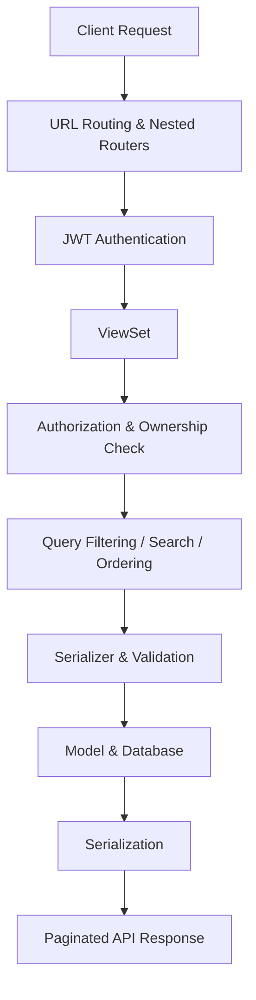

# Task Tracker API

A RESTful task management API built with **Django REST Framework**, featuring JWT authentication, user-owned projects, nested task resources, filtering, search, ordering, and pagination.

The API follows an ownership-based architecture where authenticated users can only access and manage their own projects and associated tasks.

---

## Features

- JWT-based authentication
- User registration and token refresh
- User-scoped project management
- Nested task management per project
- Full CRUD operations for projects and tasks
- Task filtering by status and priority
- Search across task titles and descriptions
- Flexible task ordering
- Page-number pagination
- Ownership-based access control

---

## Tech Stack

| Technology | Purpose |
|---|---|
| Python | Backend language |
| Django | Web framework |
| Django REST Framework | REST API development |
| Simple JWT | JWT authentication |
| django-filter | Filtering support |
| drf-nested-routers | Nested resource routing |
| SQLite | Local development database |

---

## Resource Model

```text
User
│
└── Projects
    │
    └── Tasks
```

Each `Project` belongs to an authenticated user, while each `Task` belongs to a project.

Tasks are exposed as nested resources:

```http
/api/projects/{project_id}/tasks/
```

This keeps the API structure aligned with the underlying domain relationship.

---

## API Reference

### Authentication

| Method | Endpoint | Description |
|---|---|---|
| `POST` | `/api/register/` | Register a new user |
| `POST` | `/api/login/` | Obtain access and refresh tokens |
| `POST` | `/api/token/refresh/` | Refresh an access token |

### Projects

| Method | Endpoint | Description |
|---|---|---|
| `GET` | `/api/projects/` | List authenticated user's projects |
| `POST` | `/api/projects/` | Create a project |
| `GET` | `/api/projects/{id}/` | Retrieve a project |
| `PUT/PATCH` | `/api/projects/{id}/` | Update a project |
| `DELETE` | `/api/projects/{id}/` | Delete a project |

### Tasks

| Method | Endpoint | Description |
|---|---|---|
| `GET` | `/api/projects/{project_id}/tasks/` | List project tasks |
| `POST` | `/api/projects/{project_id}/tasks/` | Create a task |
| `GET` | `/api/projects/{project_id}/tasks/{id}/` | Retrieve a task |
| `PUT/PATCH` | `/api/projects/{project_id}/tasks/{id}/` | Update a task |
| `DELETE` | `/api/projects/{project_id}/tasks/{id}/` | Delete a task |

Project and task endpoints require authentication.

---

## Authentication

The API uses **JWT Bearer Authentication**.

After logging in, include the access token with protected requests:

```http
Authorization: Bearer <access_token>
```

Access tokens can be renewed using:

```http
POST /api/token/refresh/
```

---

## Filtering, Search & Ordering

Task collections support flexible querying.

```http
# Filter by status
GET /api/projects/1/tasks/?status=TODO

# Filter by priority
GET /api/projects/1/tasks/?priority=HIGH

# Search title and description
GET /api/projects/1/tasks/?search=django

# Order by due date
GET /api/projects/1/tasks/?ordering=due_date

# Newest first
GET /api/projects/1/tasks/?ordering=-created_at

# Combine multiple parameters
GET /api/projects/1/tasks/?status=IN_PROGRESS&priority=HIGH&ordering=due_date
```

| Capability | Supported Fields |
|---|---|
| Filtering | `status`, `priority` |
| Search | `title`, `description` |
| Ordering | `due_date`, `created_at`, `priority` |

---

## Pagination

Collection endpoints use page-number pagination with **10 items per page**.

```http
GET /api/projects/1/tasks/?page=2
```

Paginated responses follow the standard DRF structure:

```json
{
  "count": 24,
  "next": "http://127.0.0.1:8000/api/projects/1/tasks/?page=2",
  "previous": null,
  "results": []
}
```

Pagination can be combined with filtering, search, and ordering.

```http
GET /api/projects/1/tasks/?status=TODO&ordering=due_date&page=2
```

---

## Access Control

Resource access is scoped to the authenticated user.

- Users can only access their own projects.
- Project ownership is assigned from the authenticated user.
- Tasks are accessed through their parent project.
- Task access is restricted by both project and project owner.
- Cross-user project and task access is prevented.

---

## Project Structure

```text
task-tracker-api/
│
├── manage.py                     # Django CLI entry point
├── requirements.txt              # Python dependencies
├── .gitignore                    # Git ignored files and directories
│
├── project/                      # Project-level configuration
│   ├── __init__.py
│   ├── settings.py               # Django, DRF, JWT & pagination settings
│   ├── urls.py                   # Root URL configuration
│   ├── asgi.py                   # ASGI application entry point
│   └── wsgi.py                   # WSGI application entry point
│
└── main/                         # Core Task Tracker application
    ├── migrations/               # Database schema migrations
    │
    ├── __init__.py
    ├── admin.py                  # Django Admin registrations
    ├── apps.py                   # Application configuration
    ├── models.py                 # Project & Task domain models
    ├── serializers.py            # API serialization & validation
    ├── views.py                  # API endpoints, access control & queries
    └── urls.py                   # API routers, nested routes & auth URLs
```

### Application Flow



The `project` package contains global application configuration, while the `main` application contains the Task Tracker domain and API implementation.

---

## Getting Started

### 1. Clone the repository

```bash
git clone <repository-url>
cd task-tracker-api
```

### 2. Create a virtual environment

```bash
python -m venv .venv
source .venv/bin/activate
```

### 3. Install dependencies

```bash
pip install -r requirements.txt
```

### 4. Apply migrations

```bash
python manage.py migrate
```

### 5. Start the development server

```bash
python manage.py runserver
```

The API will be available at:

```text
http://127.0.0.1:8000/api/
```

---

## Security

The API implements authentication and resource-level isolation through:

- JWT access tokens for protected endpoints
- Authenticated project ownership
- User-scoped project querysets
- Nested task resources
- Owner-scoped task queries
- Server-side ownership enforcement

---

## Roadmap

- Automated API testing
- OpenAPI / Swagger documentation
- PostgreSQL production configuration
- Cloud deployment
- CI pipeline for testing and linting
